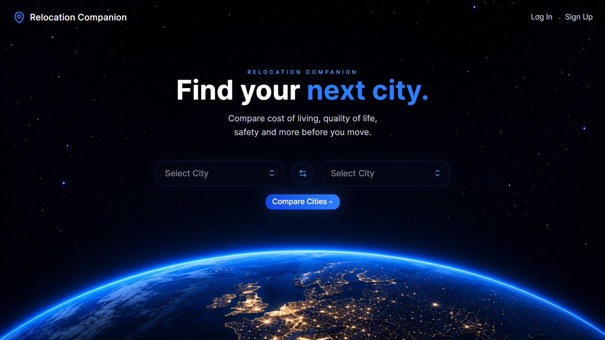

# 🌍 Relocation Companion

<p align="center">
  
</p>

A MERN app to compare cities side-by-side across affordability, cost of living, quality of life, healthcare, safety, and environment, helping you make confident, data-driven relocation decisions.

## 🔗 Live Links

- Frontend: https://relocation-companion-pro.vercel.app/
- Backend API: https://relocation-companion-api.onrender.com
- Repository: https://github.com/betterversionofpuja/relocation-companion

---

## ✨ Features

- 🌍 City Comparison
- 🔐 Authentication
- ❤️ Saved Comparisons
- 👤 User Profile
- 📱 Responsive Design

---

## 🛠 Tech Stack

### Frontend
- React
- Tailwind CSS
- Axios
- React Router
- React Context API
- Lucide React

### Backend
- Node.js
- Express REST API
- MongoDB
- Mongoose
- JWT
- Cookie Parser
- CORS

### Deployment
- Vercel
- Render

---

## 📁 Project Structure

```text
relocation-companion/
│
├── assets/                 # README images & screenshots
│   └── homepage.png
│
├── backend/                # Express REST API
│
├── deployment/             # Deployment notes & debugging journey
│
├── frontend/               # React application
│
└── README.md
```

---

## 📊 Dataset

This project uses the **World Cost of Living & Quality of Life (2024–2025)** dataset from Kaggle.

### Data Units

- **Financial / Cost Columns** *(Average Monthly Rent, Internet Costs, Average Salaries)*
  - **Unit:** **USD (United States Dollars)**
  - Monetary values are standardized in **USD**, allowing meaningful comparisons across different cities and countries.

- **Cost Indices** *(Food Cost Index, Transport Cost Index)*
  - **Unit:** **Index Points (Relative Score)**
  - These values are benchmarked against a base city (typically **New York City = 100**).
  - For example, a **Food Cost Index of 120** means the city is approximately **20% more expensive** than the baseline.

- **Quality of Life Metrics** *(Quality of Life, Safety, Healthcare, Pollution)*
  - **Unit:** **Score / Index (typically on a scale of 0–100)**
  - For **Quality of Life**, **Safety**, and **Healthcare**, **higher scores indicate better conditions**.
  - For **Pollution**, **higher scores indicate higher pollution levels (worse quality)**.

- **Temporal Column** *(Year)*
  - **Unit:** **Calendar Year** (`2024` and `2025`).

> **Note:** The dataset is **synthetically generated** using realistic ranges rather than live scraped data. It is intended for educational purposes, data visualization, exploratory data analysis (EDA), machine learning, and application development.

**Dataset Source:**  
https://www.kaggle.com/datasets/abdullahmeo/world-cost-of-living-and-quality-of-life-20242025

---

## 🌱 Future Scope

This project will evolve into an AI-powered relocation platform with intelligent agents for personalized relocation planning.

---

## 📄 License

**Proprietary / All Rights Reserved**

This repository is shared for portfolio purposes only.

---

## 👩‍💻 About the Author

**Puja Kumari**

🐦 **X (Twitter):** https://x.com/pujakumaricodes  
💼 **LinkedIn:** https://www.linkedin.com/in/betterversionofpuja  
📧 **Email:** betterversionofpuja@gmail.com

---

## ⭐ Support the Project

If you found this project useful or interesting, consider giving it a ⭐ on GitHub.

It helps others discover the project and motivates me to continue building and improving it.