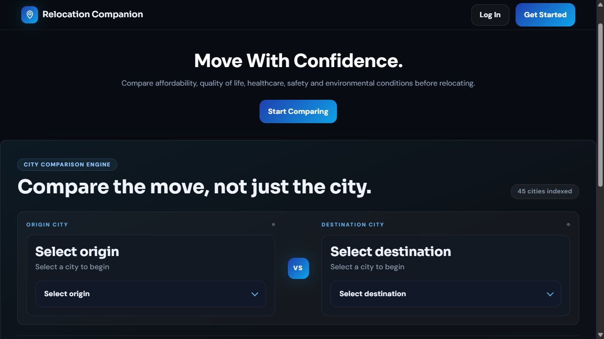

# 🌍 Relocation Companion

> **Move With Confidence. Compare the Move, Not Just the City.**

Relocation Companion is a full-stack MERN application that helps users make informed relocation decisions by comparing cities across affordability, quality of life, healthcare, safety, and environmental factors.

Relocating to a new city or country is a major life decision. Information is often scattered across multiple websites, making it difficult to evaluate whether a move is financially viable, professionally beneficial, or personally suitable.

Relocation Companion centralizes this process by providing structured city comparisons, relocation insights, and saved research in a single platform, helping users make confident and data-driven relocation decisions.

🔗 **Live Demo:** https://relocation-companion-rouge.vercel.app/

📂 **Source Code:** https://github.com/BetterVersionOfPuja/relocation-companion

---

## 📸 Application Preview

### Landing Page



*Compare affordability, quality of life, healthcare, safety, and environmental conditions before making a relocation decision.*

---

## 🚀 Why I Built This

Relocation is one of the most impactful decisions a person can make, yet the research process is often fragmented and time-consuming.

Questions such as:

* Can I afford to live there?
* How does the cost of living compare?
* Which city offers a better quality of life?
* Is relocating worth it?
* What trade-offs am I making?

usually require users to switch between multiple websites and manually compare information.

I built Relocation Companion to simplify this experience by providing a centralized platform where users can compare cities, evaluate relocation factors, save research, and make more informed decisions.

---

## ✨ Features

### 🏙️ City Comparison Engine

* Compare two cities side-by-side
* Analyze key relocation factors
* Evaluate strengths and weaknesses of each city
* Make informed relocation decisions

### 📊 Relocation Insights

Compare cities across multiple dimensions:

* Affordability
* Cost of Living
* Quality of Life
* Healthcare
* Safety
* Environmental Conditions

### 🔐 Secure Authentication

* User Registration
* Login & Logout
* Protected Routes
* User-Specific Data Access

### 💾 Save Comparisons

* Save relocation analyses
* Revisit previous comparisons
* Maintain relocation research history
 
### 📱 Responsive Design

Fully optimized for:

* Desktop
* Tablet
* Mobile Devices

### ⚡ Modern User Experience

* Fast and intuitive interface
* Clean and responsive UI
* Smooth navigation experience

---

## 🛠 Tech Stack

### Frontend

* React.js
* React Router
* Tailwind CSS
* Axios
* Context API

### Backend

* Node.js
* Express.js
* REST APIs

### Database

* MongoDB Atlas
* Mongoose

### Deployment

* Frontend: Vercel
* Backend: Render
* Database: MongoDB Atlas

---

## 🏗️ System Architecture

```text
React Frontend
       │
       ▼
REST API Layer
       │
       ▼
Express Backend
       │
       ▼
MongoDB Atlas
```

The application follows a clean client-server architecture with clear separation between:

* Presentation Layer (React)
* Business Logic Layer (Express)
* Data Layer (MongoDB)
* Authentication Layer

---

## 🔄 User Flow

### 1. Create an Account

Users can securely register and log in.

### 2. Select Cities

Choose an origin city and a destination city.

### 3. Compare Relocation Factors

View detailed insights and comparison metrics.

### 4. Save Comparisons

Store analyses for future reference.

### 5. Access Research Anytime

Review saved comparisons from the dashboard.

---

## 🔍 Technical Highlights

### Full-Stack MERN Development

Built and deployed a complete end-to-end application using the MERN stack.

### RESTful API Design

Designed scalable backend APIs for authentication, comparison workflows, and user-specific data management.

### Authentication & Authorization

Implemented secure authentication and protected routes.

### Database Modeling

Designed MongoDB schemas to manage users and saved relocation comparisons.

### State Management

Managed application-wide state for authentication and comparison workflows.

### Responsive UI Engineering

Created a consistent user experience across desktop, tablet, and mobile devices.

### Production Deployment

Successfully deployed a distributed full-stack application using modern cloud infrastructure.

---

## 📂 Project Structure

```text
relocation-companion/
│
├── client/
│   ├── src/
│   ├── components/
│   ├── pages/
│   ├── services/
│   ├── hooks/
│   └── context/
│
├── server/
│   ├── controllers/
│   ├── routes/
│   ├── middleware/
│   ├── models/
│   ├── config/
│   └── utils/
│
├── screenshots/
│   └── landing-page.png
│
└── README.md
```

---

## ⚙️ Local Setup

### Clone Repository

```bash
git clone https://github.com/BetterVersionOfPuja/relocation-companion.git
```

### Navigate to Project Directory

```bash
cd relocation-companion
```

### Install Frontend Dependencies

```bash
cd client
npm install
```

### Install Backend Dependencies

```bash
cd server
npm install
```

### Configure Environment Variables

Create a `.env` file inside the server directory:

```env
PORT=5000
MONGO_URI=your_mongodb_connection_string
JWT_SECRET=your_secret_key
```

### Run Backend

```bash
npm run dev
```

### Run Frontend

```bash
npm start
```

---

## 🎯 Skills Demonstrated

This project showcases practical experience with:

* JavaScript (ES6+)
* React.js
* Node.js
* Express.js
* MongoDB
* REST APIs
* Authentication & Authorization
* State Management
* Responsive Design
* Cloud Deployment
* Full-Stack Application Development

---

## 📌 Future Roadmap

Relocation Companion is designed to evolve beyond a city comparison tool into a complete relocation assistant that supports users throughout their entire relocation journey.

### Planned Enhancements

#### 🤖 AI-Powered Relocation Recommendations

* Personalized relocation suggestions based on user priorities
* Intelligent city matching
* Customized relocation insights and guidance

#### 💰 Relocation Budget Planner

* End-to-end relocation cost estimation
* Moving expense breakdowns
* Budget tracking and financial planning tools

#### 📊 Deep-Dive City Analysis

* More comprehensive city comparisons
* Detailed category-wise breakdowns
* Data-driven scoring and ranking system
* Interactive visualizations and reports

#### 🌍 Visa & Immigration Support

* Visa requirement information by country
* Application process guidance
* Visa document checklist management
* Progress tracking for relocation requirements

#### 🗺️ Offline Travel Utilities

* Offline maps for navigating new locations
* Offline translation tools for language assistance
* Essential local information accessible without internet connectivity

#### 🤝 Complete Relocation Companion Experience

The long-term vision is to transform Relocation Companion into a true relocation partner that assists users both:

### Before Relocation

* City research
* Cost-of-living analysis
* Visa planning
* Budget estimation
* Decision-making support

### After Relocation

* Local navigation
* Language assistance
* Settlement guidance
* Essential resources and recommendations

The goal is to provide a single platform that helps users confidently navigate every stage of their relocation journey.

---

## 👩‍💻 About the Developer

**Puja Kumari**  
Software Engineer | Full Stack Developer | Building products that solve real-world problems

- GitHub: https://github.com/BetterVersionOfPuja
- LinkedIn: https://linkedin.com/in/betterversionofpuja
- X (Twitter): https://x.com/pujakumaricodes

---

## ⭐ Feedback & Contributions

Contributions, suggestions, and feedback are always welcome.

If you found this project interesting, consider giving it a ⭐ on GitHub.

---

**Relocation Companion aims to help people make smarter relocation decisions today while evolving into a complete relocation partner for tomorrow.**
